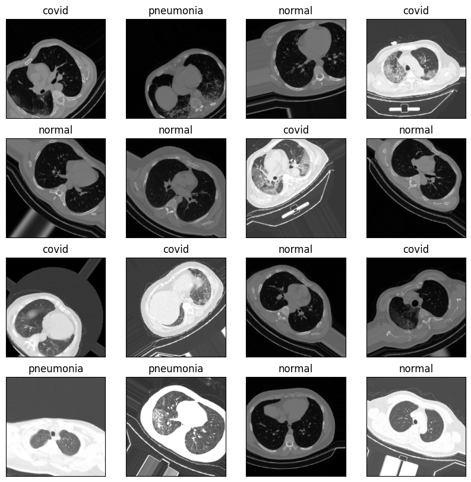
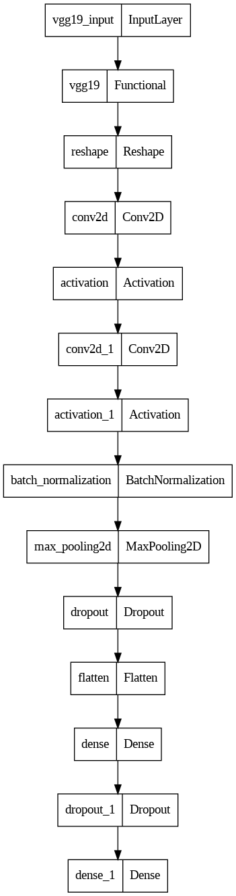

# CT scan image classification 

 I have created this project for clssify the ct scan images of covid19, pneumonia ,and normal. I used vgg19 + 2 more layers of cnn to classify this images train on different different epoch
 
 
# The images for the dataset are shown here 
 

You can find the dataset that i used  link [here](https://drive.google.com/drive/folders/1P0J0JZhu0Azb9WxR8ReskmCMt6yS9QxG?usp=share_link)

The architecture of model are :

the model result on train and validation as following :

<table>
  <tr>
    <td></td>
    <td></td>
  </tr>
  <tr>
    <td></td>
    <td></td>
  </tr>
</table>

You can find the wandb link [here](https://wandb.ai/name-nhi-socha/chel%20bhai%20start%20ho%20ja%2013%20april%20ho%20gya%20h?workspace=user-miniproject678sem)

heres i got 99% AUC and RECall for the training data but 62% recall and 75% AUC for the validation data .this is the first model that i used on this dataset i am try to build some more architecture and tuning the hyperperameter so i can get a good recall and AUC for the validation dataset. 

# [LinkedIn](https://www.linkedin.com/in/samunder-singh/)         [LICENSE](LICENSE)
